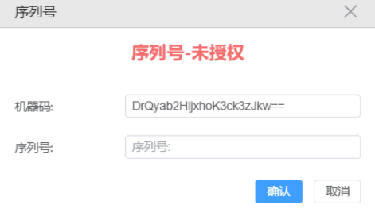
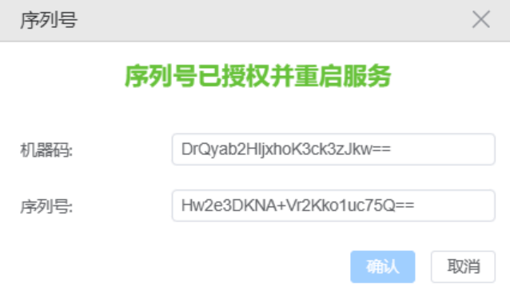
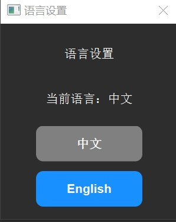

# AOI Based 3D Scan 安装部署文档

---

## 一、软件安装

### 1.1 安装步骤

1. **下载并解压安装包**
   
   下载压缩包 `3DScan_Setup.zip`，解压后得到安装文件夹：
   
   
   
2. **运行安装程序**
   
   右键点击 `3DScan_Setup.exe`，选择 **"以管理员身份运行"**，选择安装目录（建议安装到 **D 盘根目录**），安装成功后将出现 `D:\3Dscan` 文件夹。

3. **创建桌面快捷方式**
   
   在项目目录下，为 `AOI Based 3D_Scan.exe` 创建桌面快捷方式，这是后期外观检测的工作程序。

### 1.2 注意事项

> **⚠️ 注意**：安装包不强制要求安装到 D 盘根目录，也可以选择其他目录，但**建议不要安装到系统盘**（如 C 盘）。

---

## 二、现场摄像头配置

### 2.1 相机安装与调试

1. 根据提供的相机高度要求安装相机，并进行打光与调焦。

2. **推荐使用调焦软件**
   
   - **MVviewer**（推荐）
     - 下载地址：[https://www.irayple.com/cn/serviceSupport/downloadCenter/18?p=17](https://www.irayple.com/cn/serviceSupport/downloadCenter/18?p=17)
   - 或使用 **VisionPro** 软件调焦

3. **参数保存**
   
   如果通过 MVviewer 设置曝光时间等参数，可以直接点击保存，程序会自动从相机读取参数并设置，无需重复配置。

---

## 三、序列号设置

### 3.1 获取机器码

1. 打开 `AOI Based 3D_Scan.exe`，点击菜单 **"帮助" → "序列号"**。
2. 界面将显示设备的 **"机器码"**，序列号位置为空：

   

### 3.2 获取并激活序列号

1. 复制界面中的 **"机器码"**，发送给官方获取序列号。
2. 将获取的序列号填入输入框并点击提交。
3. 等待约 3 秒后，弹窗提示 **"序列号已授权并重启服务"**，左下角提示 **"启动服务成功！"**，窗口变为 **"序列号-已授权"** 状态：

   

---

## 四、中英文切换

1. 点击菜单 **"设置" → "语言设置"**
2. 在弹出的语言选择窗口中，选择需要的语言（当前语言为不可选中状态）：

   

---

## 五、工位配置

### 5.1 相机设置

1. 点击菜单 **"相机设置"**，可修改以下参数：
   
   - **相机参数**：分辨率、曝光时间、快门速度等
   - **拍照参数**：拍照模式、保存路径等
   - **拍照测试**：测试相机拍照功能

   

2. **测试拍照**：点击"测试拍照"按钮，测试相机拍照功能并保存到本地。

3. **添加相机**：点击"添加相机"，可为每个相机设置别名、分辨率、曝光时间、快门速度等参数。

> **💡 提示**：每个相机都需要设置别名，其他参数建议保持默认。点击"测试拍照"时，当前选中的相机会执行拍照。

### 5.2 相机与模型关联

1. 点击菜单 **"工位设置" → "工位管理"**，根据实际场景调整工位配置：

   

2. 选择检测工位，点击 **"关联相机ID"**。
3. 在弹出的界面中，点击 **"添加"**，从下拉框中选择相机别名和 AI 模型名称，完成配置：

   

---

## 六、问题排查

### 6.1 后台服务排查

如果遇到后台服务问题，可按以下步骤排查：

1. 打开文件资源管理器，定位到 `D:\3Dscan\backend.exe`
2. 双击直接运行该程序
3. 查看运行结果并截图，发送给技术支持人员进行分析

---