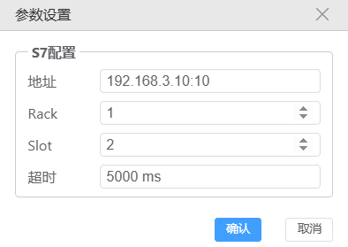
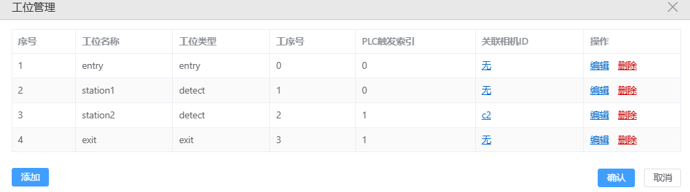
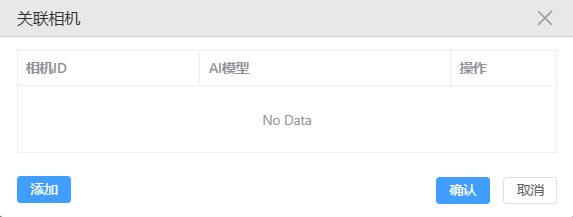
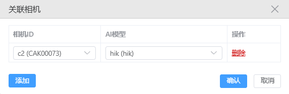
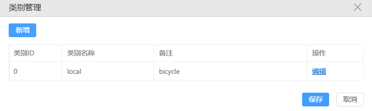
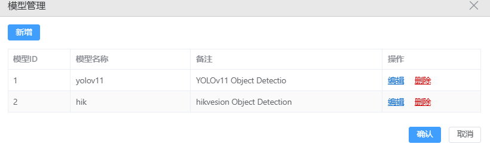
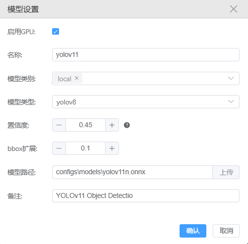
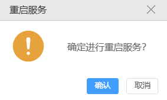
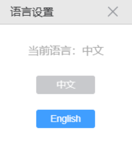

# 功能介绍

## 相机设置

- 点击菜单"相机设置"，可以修改相机参数、拍照参数和进行拍照测试。

> **提示**：每一个相机都要设置一下别名，其他信息最好保持默认值不要修改。

- 然后点击"测试拍照"的时候，当前对应的相机会执行拍照。

## 工位设置

### 参数设置

- 点击"工位设置"中的"参数设置"，可根据现场实际调整PLC参数设置，方便操作人员人机交互：

### 工位管理

- 点击菜单"工位设置"的子菜单"工位管理"，根据实际场景调整工位。

- 找到检测工位，关联相机id这一项，点击"无"后，显示如下界面。

- 点击"添加"按钮，弹出如下窗口：

- 点击添加，上面会出现所接入的相机别名和AI模型名称下拉框，为工位配置好相机和对应模型。

> **说明**：为防止误操作，表格状态默认锁定，要添加检测工位或者修改工位个别工位，需要点击编辑，在下面的窗口进行修改。

## 模型管理

### 类别管理

- 点击"新增"添加缺陷类别，想要修改缺陷类别名称，表格是锁定状态不可修改，需要点击操作栏下面的"编辑"进行解锁，才可以修改表格。

- 点击主界面的缺陷结果信息中的分类数据，不是分类，是分类的数据，可以跳到当前界面，方便操作人员查看。

> **注意**：需要删除类别请联系官方！

### 模型设置

- 模型设置窗口如图所示，可以进行新增、修改和删除。

- 点击"编辑"可以具体修改配置：

- 模型类别会显示在类别管理中配置的缺陷类别：
- 置信度等同于阈值，只会标注高于这个阈值的缺陷。

> **注意**：此界面修改必须要点击两个"确定"按钮才会保存设置。

## 调试

### 重启服务

- 如果发现软件出现一直报错，料框卡住等状况，则可尝试重启服务，同时把日志发给研发排查问题。

### 语言设置

- 设置 -> 语言设置

- 出现如下弹窗，选择对应的语言，点击后出现语言设置窗口，选择对应需要的语言，当前语言为不可选中状态：

- 点击要选的语言后会出现确认弹窗，点击确定会立即退出，点击取消则不会切换语言。
