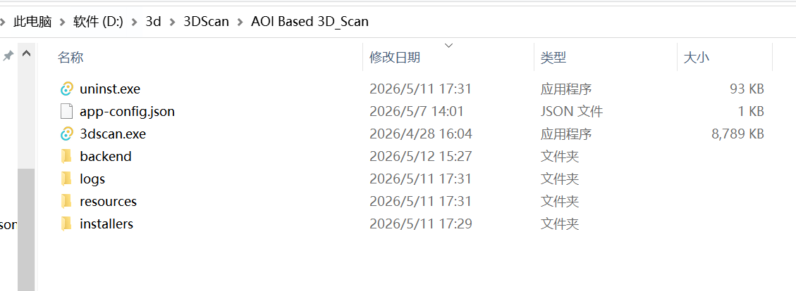
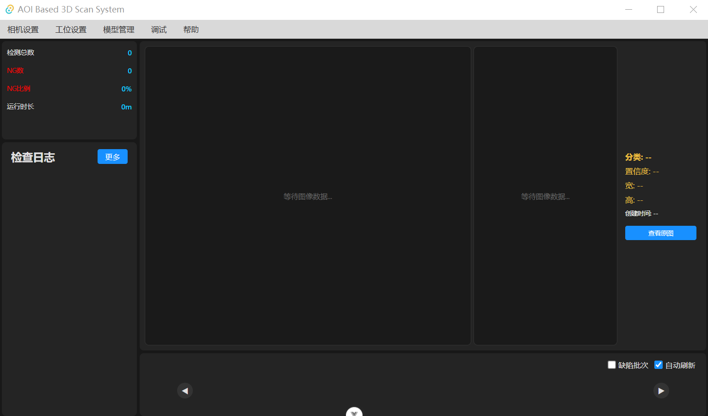

# 界面介绍

## 程序启动

- 1.下载压缩包3DScan_Setup.zip放到D盘并解压，得到如图所示文件夹。

- 然后右键点击3DScan_Setup.exe，选择“以管理员身份运行”，选择所要安装的目录，一般是D盘根目录，成功后将出现D:\3Dscan文件夹,这是项目文件夹。

- 初次运行程序如下图所示：

> **注意**：需要输入序列号激活程序。

### 仪表盘

- 显示已经该次启动(当前批次)的检测总数，NG数，NG比例和运行时间。

### 检查日志区

- 显示最新的一百条重启服务日志和各个工位流程和检测结果信息。

- 若日志太长可点击一下要查看的日志，出现点击手势图标后，鼠标悬停查看完整日志信息，或者也可以拉动详情面板和侧边栏中间的更多日志中查看。

### 详情面板

- 最左侧显示工位/相机（仅显示配置了相机的工位），左二大图显示检测后的标注图，点击上面的绿色标注，将会在右侧当前选中的缺陷结果图和结果信息。

- 右侧显示当前选中的缺陷结果图和结果信息。

> **提示**：点击详情面板缺陷结果信息中的分类数据（红色框出位置），可以跳转到该缺陷类别管理位置。

### 批次切换

- 可以任意查看已检测的图像信息，勾选自动刷新时，自动定位到最新检测批次。

