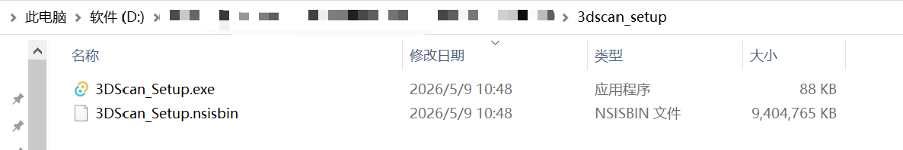
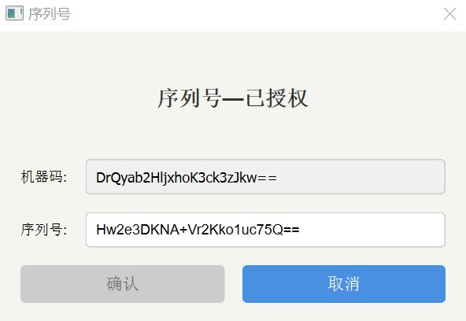
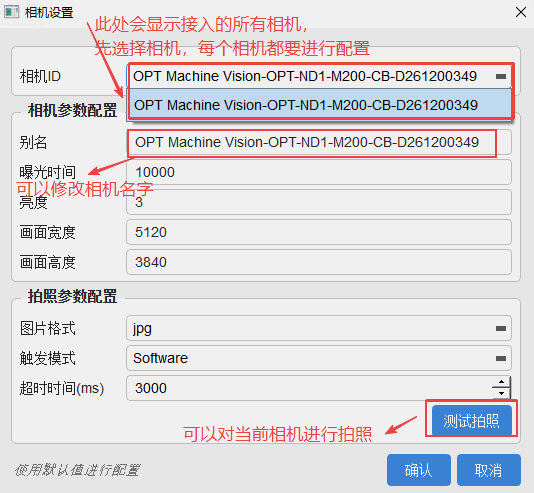

# AOI Based 3D Scan 安装部署文档

## 软件安装

1. 下载压缩包3DScan_Setup.zip，并解压，得到如图所示文件夹。

然后右键点击3DScan_Setup.exe，选择"以管理员身份运行"，选择所要安装的目录，一般是 D 盘根目录，成功后将出现 D:\3Dscan 文件夹。

> **注意**：安装包安装时，不强制要求安装到 D 盘根目录，也可以选择其他目录，但建议不要安装到系统盘（如 C 盘）。

2. 在项目目录下，创建 AOI Based 3D_Scan.exe 桌面快捷方式，这就是后期外观检测的工作程序。

3. 

## 现场摄像头配置

1. 根据提供的相机高度等要求安装并打光与调焦。

2. 建议使用 MVviewer 软件调焦。

   - 下载地址：https://www.irayple.com/cn/serviceSupport/downloadCenter/18?p=17
   - 或使用 VisionPro 软件调焦

3. 如果有通过 MVviewer 设置曝光时间等，可以直接点击保存，我们程序会自动从相机读取参数并设置，不需要重复设置。

## 序列号设置

1. 打开 AOI Based 3D_Scan.exe，点击菜单"帮助"->"序列号"，界面会显示出该设备的"机器码"，同时序列号位置为空。
  

2. 复制界面中的"机器码"，并发给官方获取序列号。

3. 将序列号填入并提交，此时序列号步骤完成。等待3s，弹窗提示"序列号已授权并重启服务"，左下角提示"启动服务成功！"，窗口变成"序列号-已授权"状态：

## 中英文切换

- 设置 -> 语言设置

- 出现如下弹窗，选择对应的语言，点击后出现语言设置窗口，选择对应需要的语言，当前语言为不可选中状态：

## 工位配置

### 相机设置

- 点击菜单"相机设置"，可以修改相机参数、拍照参数和进行拍照测试。
  

- 点击"测试拍照"，可以测试相机拍照功能，并保存到本地。

- 点击"添加相机"，可以添加多个相机，每个相机都可以设置自己的别名、分辨率、曝光时间、快门速度等参数。

> **提示**：每一个相机都要设置一下别名，其他信息最好不要修改。然后点击"测试拍照"的时候，当前对应的相机会执行拍照。

### 相机、模型配置

- 点击菜单"工位设置"的子菜单"工位管理"，根据实际场景调整工位。

- 找到检测工位，关联相机id这一项，点击"无"后，显示如下界面。

- 点击添加，上面会出现所接入的相机别名和AI模型名称下拉框，为工位配置好相机和对应模型。

## 问题排查

- 进行后台服务问题排查时，可以点击"D:\3Dscan\backend.exe"，直接运行查看结果并截图发送给技术支持。
